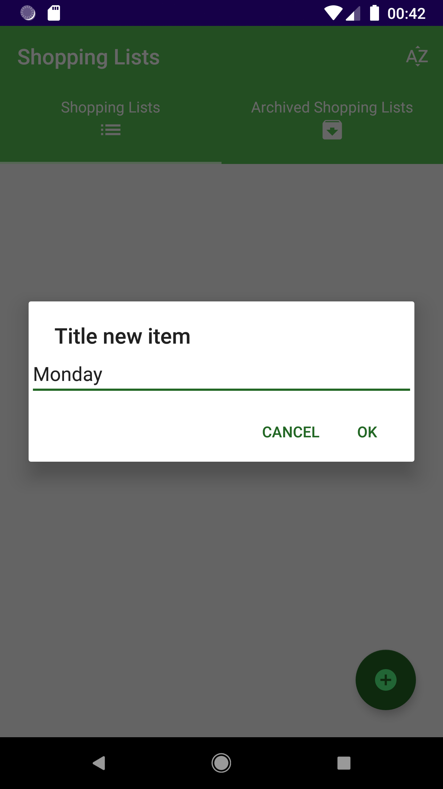
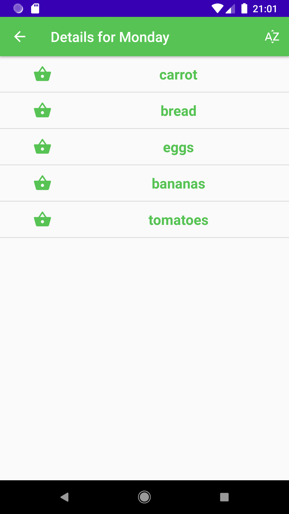

Mobile application for saving a shopping list.

The application allows you to create multiple shopping lists.
You can add name list, sort the view of all shopping by date added.

  
  
  

You can add products to each list. After a long click on a given product, you can edit it. You can delete products by clicking on the circle icon. You can sort the product list by the date the product was added.

  
  
  
  

Shopping lists can be archived by a long click on the list. Then the list with its contents is transferred to the archived list.

  
  
  

